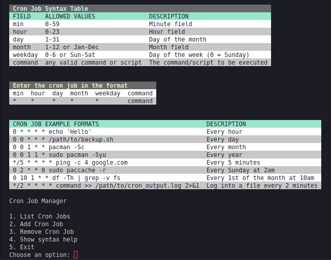

# Cron Job Manager

A CLI tool to simplify the management of cron jobs on Linux systems. With an easy-to-navigate menu, this tool lets you list, add, and remove cron jobs while providing helpful syntax guidance.



## Features

- View all active cron jobs in a formatted table.

- Add new cron jobs using example formats and syntax tips.

- Select a cron job to remove by its number in the list.

- Display a detailed table of cron syntax and examples for quick reference.


## Installation
1. Clone the repository:
```
git clone https://github.com/westoleaboat/cron-manager-cli.git
cd cron-manager-cli
```
2. Build the executable
```
go build -o cron-manager
```
3. Run
```
./cron-manager
```

## Usage
Upon running the script, you will be presented with the main manu:
```
Cron Job Manager

1. List Cron Jobs
2. Add Cron Job
3. Remove Cron Job
4. Show syntax help
5. Exit
```
1. List Cron Jobs
Displays a table of current cron jobs or informs you if no cron jobs are set.

2. Add Cron Job
Prompts you to enter a cron job in the correct format. Type help to view syntax guidance or back to return to the menu.

3. Remove Cron Job
Displays current cron jobs with a number for each. Select the number of the job to remove or type back to return to the menu.

4. Show Syntax Help
Displays a table with detailed cron syntax and examples for easy reference.

5. Exit
Exits the program.

### Basic Examples

>Please keep in mind that the cron expression format may vary depending on the system or application you are using. These examples are in the standard Linux cron format.

|Cron Expression | Description|
|---|---|
|0 * * * * echo "Hello"	|Runs every hour, on the hour.|
|30 7 * * * backup.sh	|Runs daily at 7:30 AM, executing a backup script.|
|*/5 * * * * ping 8.8.8.8	|Runs every 5 minutes to ping Google's DNS server.|
|0 0 1 * * pacman -Syu	|Runs on the 1st of every month to update the system.|
|15 14 1 * * echo "Pay bills"	|Runs at 2:15 PM on the 1st of every month.|

### Weekly or specific Day Examples
|Expression|Description|
|---|---|
|0 9 * * 1 echo "Weekly report"|Runs at 9:00 AM every Monday.|
|0 2 * * 0 sudo apt-get update	|Runs every Sunday at 2:00 AM to update the system.|
|0 18 * * 5 echo "Happy Friday"|Runs every Friday at 6:00 PM.|

### Advance Examples

|Cron Expression|	Description|
|---|---|
|0 */2 * * * echo "Every 2 hours"	|Runs every 2 hours, at the start of the hour.|
|0 8-17 * * * echo "Work hours"	|Runs hourly between 8:00 AM and 5:00 PM.|
|*/10 9-17 * * 1-5 curl https://example.com	|Runs every 10 minutes during work hours (Monday to Friday).|
|0 6 1 1,7 * echo "Biannual message"	|Runs at 6:00 AM on January 1st and July 1st every year.|
|0 12 1 * 2 echo "First Tuesday of the month" | Runs at noon on the first Tuesday of each month.|

### Logging and File Management Examples
|Cron Expression	|Description|
|---|---|
|0 0 * * * find /tmp -type f -mtime +7 -delete	|Deletes files in /tmp older than 7 days, daily at midnight.
|0 */6 * * * df -h > /home/user/disk_report.log	|Saves disk usage report every 6 hours to a log file.
|*/15 * * * * ps aux >> /home/user/process.log|Logs running processes every 15 minutes.|


### Backup and Maintenance Examples
|Cron Expression	|Description|
|---|---|
|0 3 * * * tar -czf /backup/home.tar.gz ~	|Backs up the home directory at 3:00 AM every day.|
|0 4 1 * * rsync -a ~/data /backup/	|Runs monthly data synchronization on the 1st at 4:00 AM.|
|0 2 * * 7 mysql_backup.sh	|Backs up a MySQL database every Sunday at 2:00 AM.|

### More Examples
| Cron Expression | Description | Runs | 
| --- | --- | --- | 
| 0 0 * * * | Run at midnight every day | Daily at 12:00 AM | 
| 0 0 * * 0 | Run at midnight every Sunday | Weekly on Sundays at 12:00 AM | 
| 0 0 1,15 * * | Run at midnight on the 1st and 15th of every month | Monthly on the 1st and 15th at 12:00 AM | 
| 0 12 * * * | Run at noon every day | Daily at 12:00 PM | 
| 0 0-23/2 * * * | Run every 2 hours | Every 2 hours (e.g., 12:00 AM, 2:00 AM, 4:00 AM, ...) | 
| 0 0 * * 1-5 | Run at midnight Monday through Friday | Weekdays (Monday to Friday) at 12:00 AM | 
| 0 8-17 * * * | Run every hour from 8am to 5pm | Every hour from 8:00 AM to 5:00 PM | 
| 0 0 1 * * | Run at midnight on the first day of every month | Monthly on the 1st at 12:00 AM | 
| 0 0 * * * * | Run every minute | Every minute |

### TODO 

1. Error handling: The addCronJob function does not handle errors well. If an error occurs while adding a cron job, it simply prints the error message and continues executing. It would be better to handle errors more robustly, such as by returning an error value or panicking.

2. Input validation: The addCronJob function does not validate the user's input. If the user enters an invalid cron job format, the function will fail. It would be better to validate the input before attempting to add the cron job.
3. Code duplication: The listCronJobs and removeCronJob functions have similar code for fetching and parsing the cron jobs. This code could be extracted into a separate function to avoid duplication.
4. Magic numbers: The code uses magic numbers (e.g., 0, 1, 2) to represent the different stages of the program. It would be better to define constants for these values to make the code more readable.
5. Function length: Some of the functions (e.g., addCronJob, removeCronJob) are quite long and complex. It would be better to break them down into smaller, more manageable functions.
6. Variable naming: Some of the variable names (e.g., m, t) are not very descriptive. It would be better to use more descriptive names to make the code easier to understand.
7. Comments: While there are some comments in the code, there could be more. It would be helpful to add comments to explain the purpose of each function and how it works.
8. Type definitions: The code uses the tea.Model and tea.Cmd types, but these types are not defined in the code. It would be better to define these types explicitly to make the code more self-contained.
9. Improve menu styling.